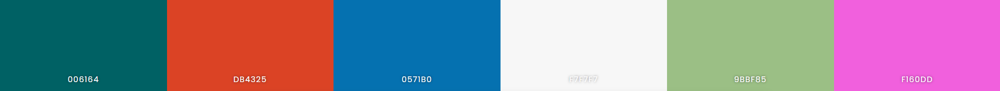

# ICS4U-2022-Final-Project-Devin
# Red-Green designed colorscheme Colorscheme

### Descrpiton
This is a colorscheme designed to be used by people who specisfically have red-green colorblindness. It is currently unfinished in this state as i dont quite have the knowledge to know how to properly run it in my neovim set up. However I do know the colors will work for someone who is red green colorblind as I am.

### Research
I got some of the color ideas from this website: https://www.visualisingdata.com/2019/08/five-ways-to-design-for-red-green-colour-blindness/ 
The full colorscheme is as follows. 

### Credit

The color script comes from this repo: https://github.com/ChristianChiarulli/nvcode-color-schemes.vim

### Requirements 

This color scheme requires [Neovim](https://neovim.io/) > 0.5.
